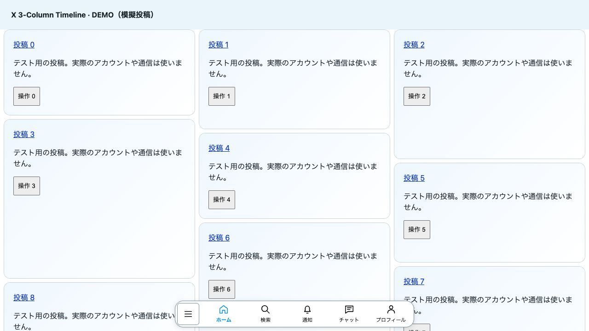
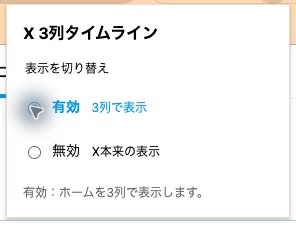

[日本語](README.md) | **English** | [简体中文](README.zh-CN.md) | [한국어](README.ko.md)

# X 3-Column Timeline

An unofficial Chrome extension that displays your X home timeline in three independent columns with less empty space. **v0.8.5 / MIT**

- **Three columns with stable lane assignments**: new posts go into the shortest column. Additional posts load through X's native loading behavior.
- **Bottom navigation**: Home, Search, Notifications, Chat, and Profile. The square button on the left opens X's native menu.
- **Enable or disable from the extension icon**: switch between three columns and X's original layout. Your preference is saved locally in the browser.
- Tall media is automatically reduced. Only the home timeline (`/home`) is supported.

## Demo

[Watch / download the video (MP4)](assets/demo.mp4)

A roughly 10-second recording of scrolling on X, cropped to remove the browser toolbar. The MP4 plays at the original speed; the GIF is a lightweight preview. Performance varies with your device and connection.

Click the extension icon to toggle the layout:

## Installation

1. Select **Code → Download ZIP** and extract the archive.
2. Open `chrome://extensions` and turn on **Developer mode**.
3. Click **Load unpacked** and select the folder containing `manifest.json`.
4. Disable other timeline layout extensions and reload X.

To update, replace the files, reload the extension on the extensions page, and reload X. The extension is not published on the Chrome Web Store, so updates are manual.

## Limitations and privacy

This is an experimental extension, not affiliated with X. Changes to X's page structure or your environment may cause layout issues. Visual order may differ from the original post order and keyboard navigation order. Unread badge mirroring is not supported. Compatibility with every window width, zoom level, or other extension, and long-session stability are not guaranteed.

No custom server, analytics, or external data transmission. The `storage` permission is used only to save the on/off preference locally. X page elements and post identifiers are used in memory for layout, but post text and account information are not persisted. X's own network activity is separate.

## Development

No build step or npm dependencies. Run `node test/popup.test.js`, `node test/masonry.test.js`, and `node test/layout.test.js` with Node.js.

Run `python3 -m http.server 8765 --bind 127.0.0.1` and open `/test/fixture.html` on that server for browser checks. Reload between scenarios. Add `?demo` for a mock recording layout. Some reading-position tests may not find a reference post at certain viewport sizes.

Report bugs in [Issues](https://github.com/purinzan/x-three-column-timeline/issues), including reproduction steps, your Chrome version, and window width / zoom level. Do not post credentials or raw traces from real pages.

[MIT License](LICENSE) · Modification, redistribution, and commercial use permitted.
